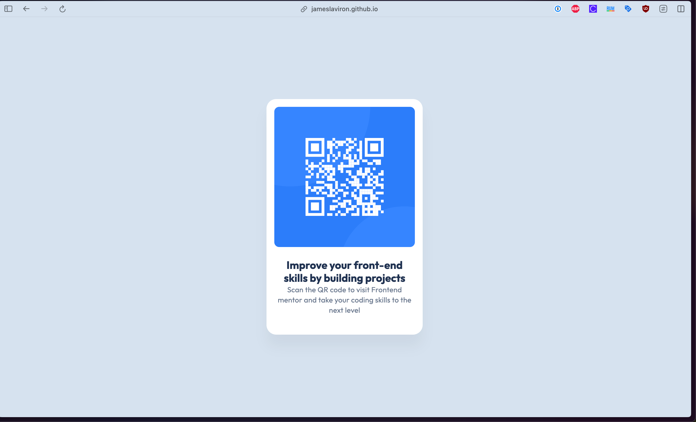
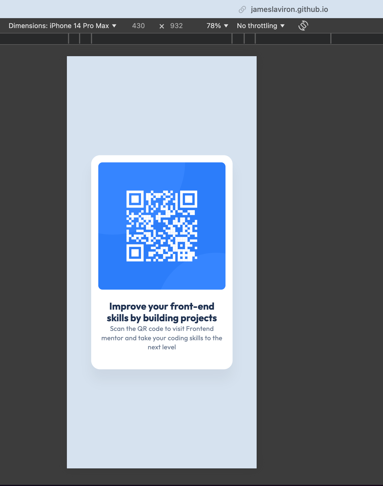

# Frontend Mentor - QR code component solution

This is a solution to the [QR code component challenge on Frontend Mentor](https://www.frontendmentor.io/challenges/qr-code-component-iux_sIO_H). Frontend Mentor challenges help you improve your coding skills by building realistic projects.

## Table of contents

- [Overview](#overview)
  - [Screenshot](#screenshot)
  - [Links](#links)
- [My process](#my-process)
  - [Built with](#built-with)
  - [What I learned](#what-i-learned)
  - [Continued development](#continued-development)
  - [Useful resources](#useful-resources)
- [Author](#author)

**Note: Delete this note and update the table of contents based on what sections you keep.**

## Overview

### Screenshot

#### Desktop result

#### Mobile result

### Links

- Solution URL: [Github pages](https://jameslaviron.github.io/qr-code-component-main/)

## My process

### Built with

- Semantic HTML5 markup
- CSS custom properties
- Flexbox

### What I learned

I learned when to use flexbox and especially when to not use it. I learned the difference between inline and block elements, how to identify them.

I learned how flex/grid specific properties work.

I learned how to use figma and stick to a very specific and precise design.

### Continued development

I would like to work more with grid layout and flexbox. I also would like to improve on basic css properties and avoid useless/messy codes.

### Useful resources

- [Flexbox](https://css-tricks.com/snippets/css/a-guide-to-flexbox/) - This helped me a lot to understand flexbox behavior.
- [block/inline](https://la-cascade.io/articles/la-difference-entre-block-et-inline) - This french site helped me deeply understand the difference between block and inline elements.

## Author

- Frontend Mentor - [@JamesLaviron](https://www.frontendmentor.io/profile/JamesLaviron)
